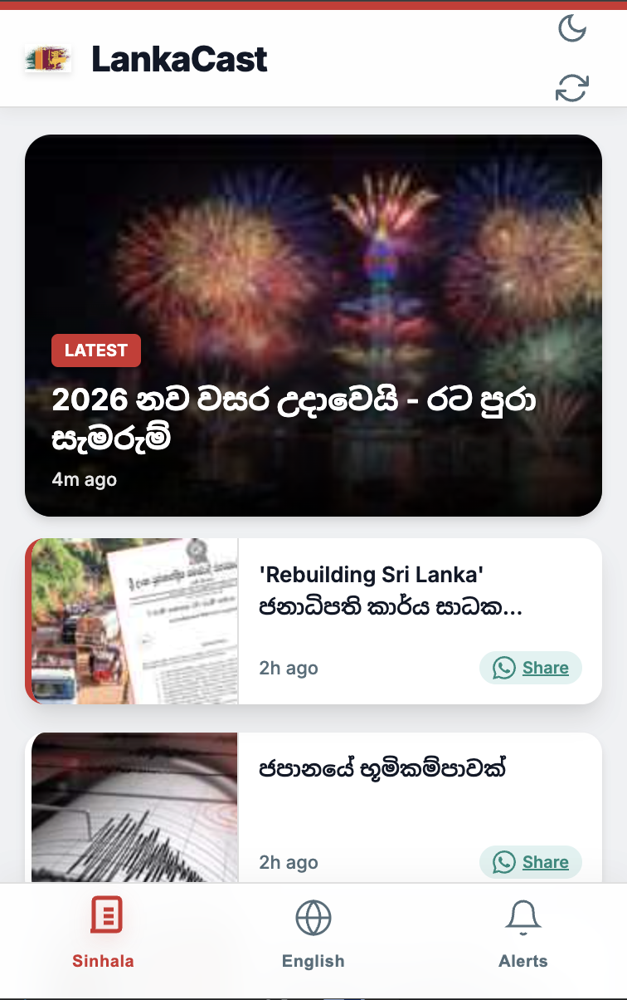
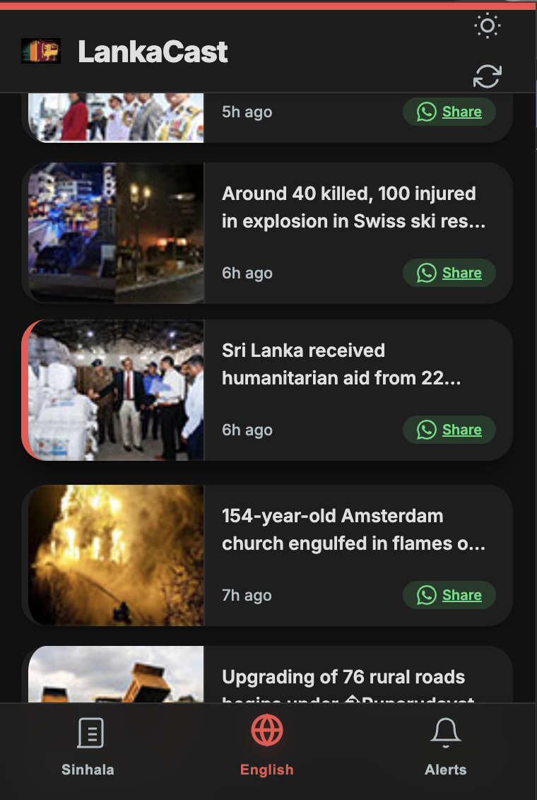
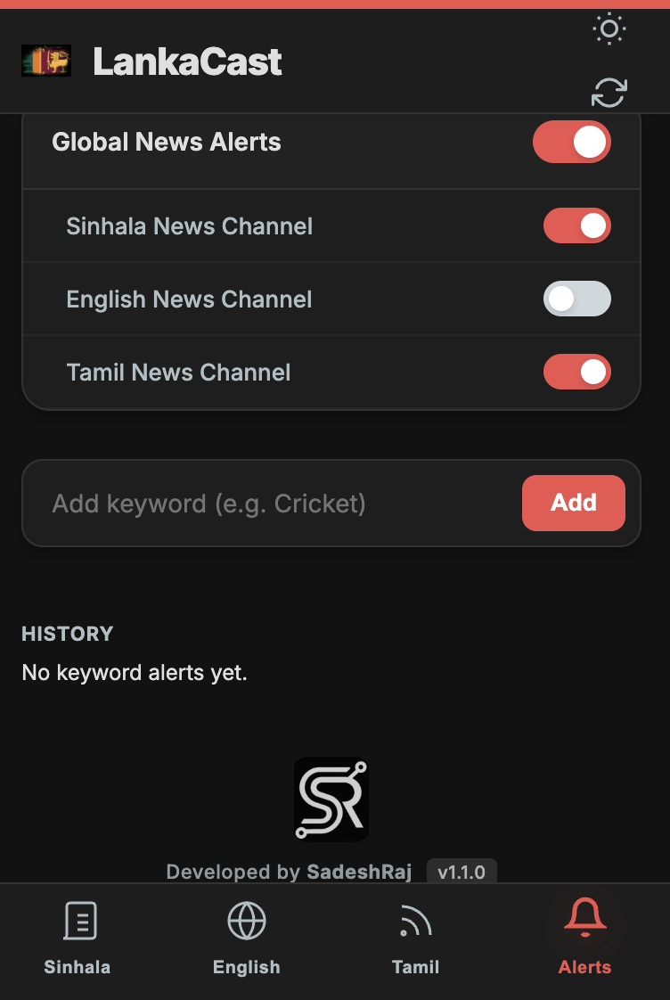
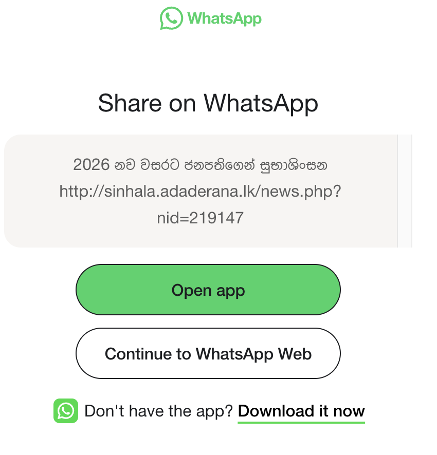
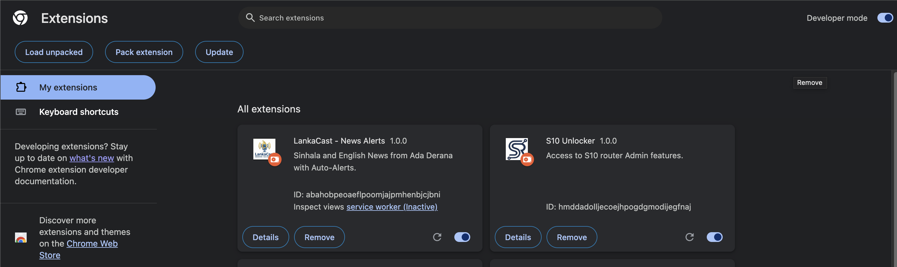

# 🇱🇰 LankaCast - Sri Lankan News Extension


> **The ONE AND ONLY browser extension delivering both Sinhala and English news from Sri Lanka directly to your toolbar.**

**LankaCast** is a unique, lightweight Chrome Extension designed for Sri Lankans. It fetches real-time news exclusively from **Ada Derana** and keeps you connected with what's happening in the island. It features automatic background updates, smart keyword alerts, dark mode, and one-click WhatsApp sharing.

---

## 📥 Download

LankaCast is officially available on the Chrome Web Store! You can install it directly to your browser with a single click:

[](https://chromewebstore.google.com/detail/akogncemlpgmleogjdblpbcdndlabhpk?utm_source=item-share-cb)

**[📂 Access the Source Code on Google Drive](https://drive.google.com/drive/folders/15PSvn_ayfUBqu-Sr84MCvvwNH_AvtKyt?usp=sharing)**

---

## 📸 Screenshots

| **Sinhala Feed** | **English Feed** | **Settings & Alerts** |
|:---:|:---:|:---:|
|  |  |  |

| **WhatsApp Sharing** | **Extension Installed** |
|:---:|:---:|
|  |  |

---

## ✨ Unique Features

* **📰 Dual-Language Hub:** Seamlessly switch between **Sinhala** and **English** news feeds in one popup.
* **⚡ Auto-Refresh:** Background service workers fetch updates every minute to keep you current.
* **🔔 Smart Alerts:** Set custom keywords (e.g., "Cricket", "Election") to receive instant notifications when they appear in the news, even if popup notifications are turned off.
* **🌙 Dark Mode:** Fully optimized dark theme that syncs with your preferences.
* **📲 Quick Share:** Share any news item directly to **WhatsApp** with a single click.
* **🛡️ Reliability:** Built on Manifest V3 for better performance and battery life.

---

## 🚀 Installation Guide 

Installing LankaCast takes just a few seconds:

### **Step 1: Go to the Web Store**
Click the **[Chrome Web Store Link](https://chromewebstore.google.com/detail/akogncemlpgmleogjdblpbcdndlabhpk?utm_source=item-share-cb)** to open the official extension page.

### **Step 2: Add to Chrome**
1. Click the blue **"Add to Chrome"** button.
2. A prompt will appear asking for permissions. Click **"Add extension"**.
3. 🎉 **Success!** You will see the **LankaCast** icon (Lion Flag) added to your browser.

> **Tip:** Click the "Puzzle Piece" icon 🧩 in Chrome and **Pin** 📌 LankaCast to keep it permanently visible in your toolbar!

---

## 📖 How to Use

### 1. Reading News
* Click the extension icon to open the popup.
* Use the bottom navigation bar to switch between **Sinhala** and **English** tabs.
* Click any news card to read the full story on the official Ada Derana website.

### 2. Setting Keyword Alerts
* Go to the **Alerts** tab.
* Type a keyword (e.g., `Cricket`) in the input box and click **Add**.
* You will now receive a system notification whenever a news title matches that keyword.

### 3. Dark Mode
* Click the **Sun/Moon Icon** in the top header to toggle between Light and Dark modes instantly.

---

## 🛠️ Tech Stack

* **Frontend:** HTML5, CSS3 (Native CSS Variables)
* **Logic:** JavaScript (ES6+, Async/Await)
* **Platform:** Chrome Extension Manifest V3
* **Storage:** `chrome.storage.local` for settings and history
* **APIs:** Ada Derana RSS Feeds & Google Analytics 4

---

## 📂 Project Structure

```text
LankaCast/
├── manifest.json       # Extension configuration (Permissions, V3)
├── popup.html          # Main UI structure
├── popup.css           # Styling
├── popup.js            # UI logic & Data rendering
├── background.js       # Background fetcher & Notification logic
├── README.md           # Documentation
└── images/             # Icons
```
## 👨‍💻 Developer
### Solution by *SadeshRaj*.
## 📜 License
### This project is open-source and available under the MIT License.
