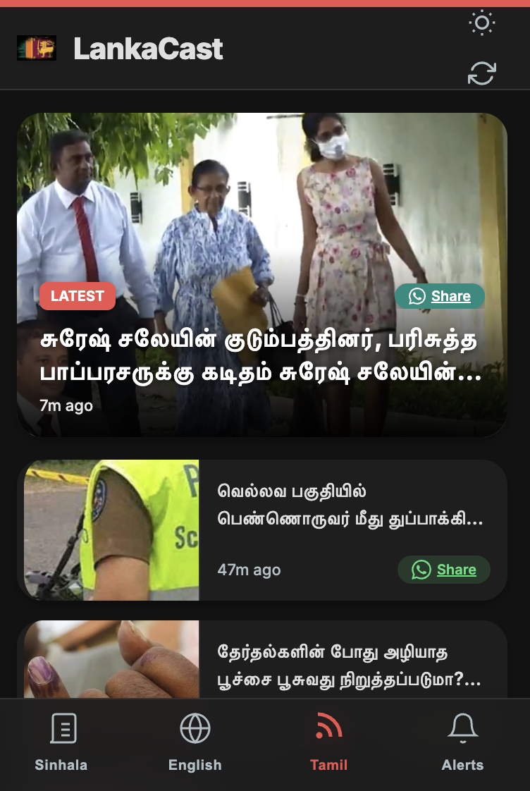

# 🇱🇰 LankaCast - Sri Lankan News Extension


> **The ULTIMATE browser companion delivering Sinhala, English, and Tamil news from Sri Lanka directly to your toolbar.**

**LankaCast** is a premium, lightweight Chrome Extension designed for Sri Lankans. It fetches real-time news exclusively from **Ada Derana** and keeps you instantly connected with everything happening on the island. It features independent multi-language channel notification toggles, smart keyword tracking, native dark mode, and seamless multi-placement WhatsApp sharing.

---

## 📥 Download

LankaCast is officially available on the Chrome Web Store! You can install it directly to your browser with a single click:

[](https://chromewebstore.google.com/detail/akogncemlpgmleogjdblpbcdndlabhpk?utm_source=item-share-cb)

**[📂 Access the Source Code on Google Drive](https://drive.google.com/drive/folders/15PSvn_ayfUBqu-Sr84MCvvwNH_AvtKyt?usp=sharing)**

---

## 📸 Screenshots

| **Sinhala Feed** | **English Feed** | **Tamil Feed** | **Settings & Alerts** |
|:---:|:---:|:---:|:---:|
|  |  |  |  |

| **WhatsApp Sharing** | **Extension Installed** |
|:---:|:---:|
|  |  |

---

## ✨ Unique Features

* **📰 Tri-Lingual Hub:** Seamlessly switch between **Sinhala**, **English**, and **Tamil** news feeds instantly within a single popup panel.
* **⚙️ Granular Channel Control:** Customize your alerts by turning off specific language streams while keeping others active. Includes a Master Switch to override and silence all global streams instantly.
* **⚡ Background Syncing:** Runs on a low-memory service worker that syncs updates every minute, optimized out-of-the-box for **Windows** and **macOS**.
* **🔔 Smart Alerts:** Set custom tracking keywords (e.g., "Cricket", "Election") to receive instant desktop notifications the second a matching title hits the wire—even if global channels are muted.
* **🌙 Interactive Dark Theme:** High-end UI that perfectly matches dark style layouts for comfortable reading during late hours.
* **📲 Multi-Placement Share:** Share standard card links or the top-pinned primary **Latest News Hero Banner** directly to WhatsApp with a single click.

---

## 🚀 Installation Guide 

Installing LankaCast takes just a few seconds:

### **Step 1: Go to the Web Store**
Click the **[Chrome Web Store Link](https://chromewebstore.google.com/detail/akogncemlpgmleogjdblpbcdndlabhpk?utm_source=item-share-cb)** to open the official extension page.

### **Step 2: Add to Chrome**
1. Click the blue **"Add to Chrome"** button.
2. A prompt will appear asking for permissions. Click **"Add extension"**.
3. 🎉 **Success!** You will see the **LankaCast** icon (Lion Flag) added to your browser.

> **Tip:** Click the "Puzzle Piece" icon 🧩 in Chrome and **Pin** 📌 LankaCast to keep it permanently visible in your toolbar!

---

## 📖 How to Use

### 1. Reading News
* Click the extension icon to open the popup.
* Use the bottom navigation bar to switch between the **Sinhala**, **English**, and **Tamil** tabs.
* Click any news card or top hero banner to read the full story on the official Ada Derana website.

### 2. Managing Notification Channels
* Go to the **Alerts** tab.
* Toggle individual sliders under the *Global News Alerts* card to fine-tune which language streams are allowed to drop desktop updates.
* Toggle the **Global Master Override** off to silence all channels effortlessly.

### 3. Setting Keyword Alerts
* Go to the **Alerts** tab.
* Type a custom search word (e.g., `Economy`) in the input box and click **Add**.
* You will now receive a priority system notification whenever a news title matches that phrase.

---

## 🛠️ Tech Stack

* **Frontend:** HTML5, CSS3 (Native CSS Variables)
* **Logic:** JavaScript (ES6+, Async/Await)
* **Platform:** Chrome Extension Manifest V3 (Internationalized Engine)
* **Storage:** `chrome.storage.local` for settings, channels, and keyword alerts history
* **APIs:** Ada Derana Live Web Feeds (Fully CORS Preflight Compliant)

---

## 📂 Project Structure

```text
LankaCast/
├── manifest.json       # Extension configurations & locale routing (V3)
├── popup.html          # Tri-lingual multi-tab application dashboard layout
├── popup.css           # Global theme matrices & layout styles
├── popup.js            # Reactive rendering and storage event engine
├── background.js       # Background fetch routines & non-intrusive alert system
├── whats-new.html      # Product update logs presentation template
├── whats-new.js        # Parameter parser for release versions
├── README.md           # Documentation
├── _locales/           # i18n Internationalization localization files (en, si, ta)
└── images/             # Icons & layout asset flags
```

## 👨‍💻 Developer

### Solution by *SadeshRaj*.

## 📜 License

### This project is open-source and available under the MIT License. 
